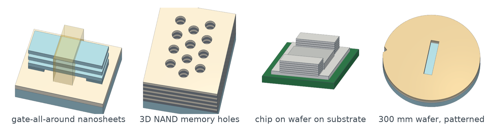
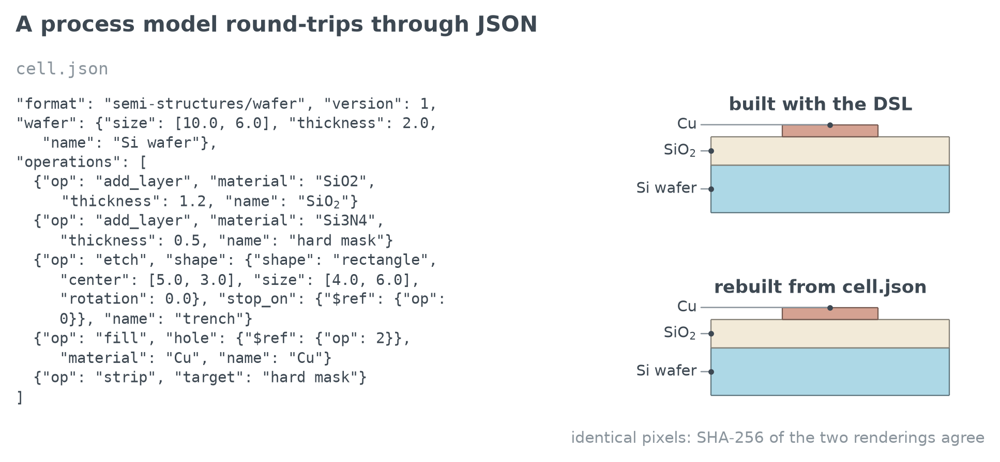
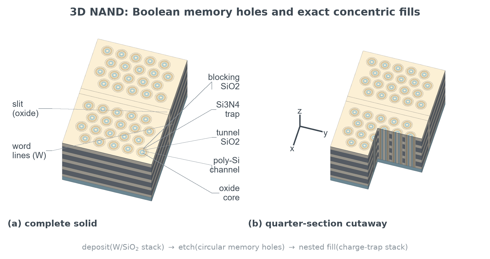
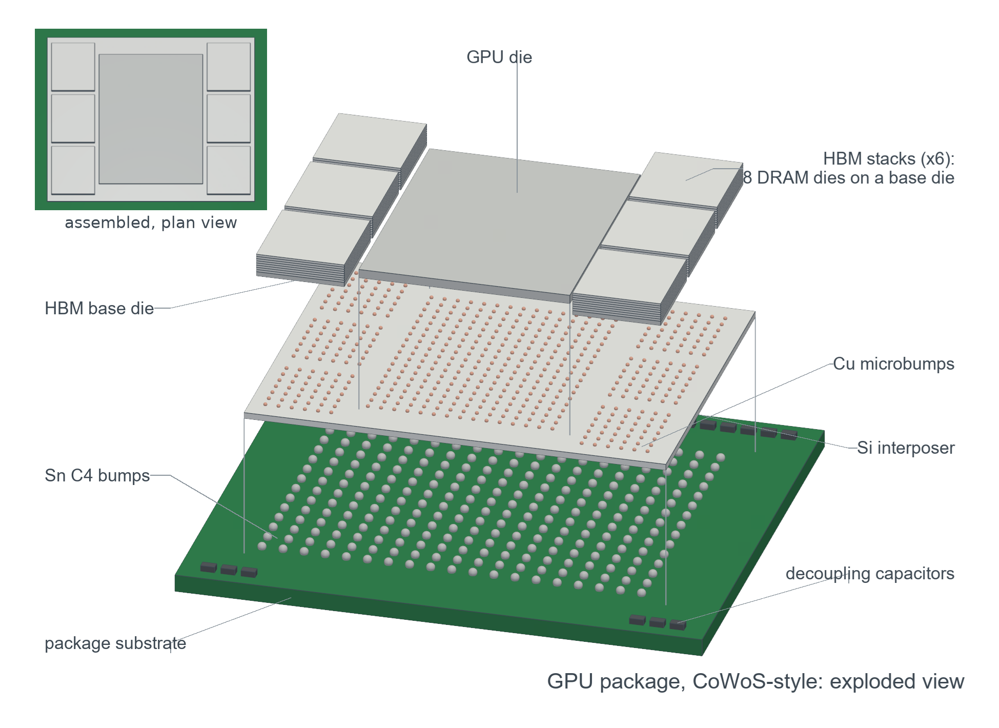
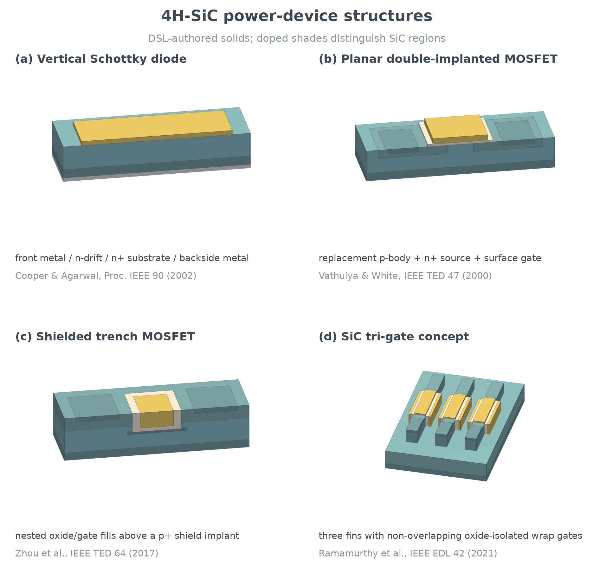
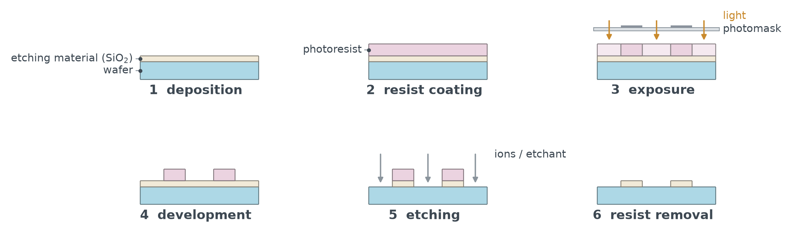
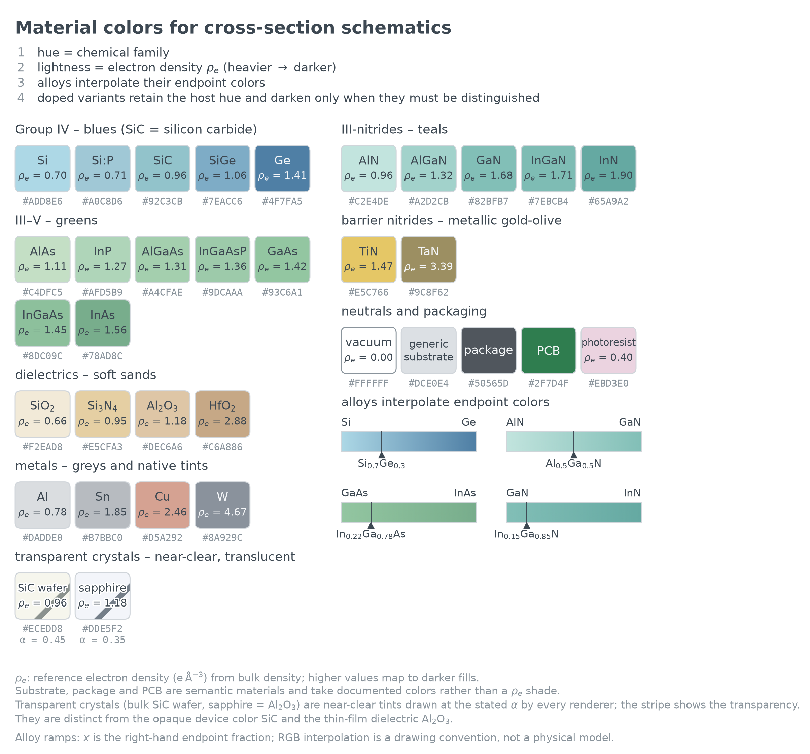
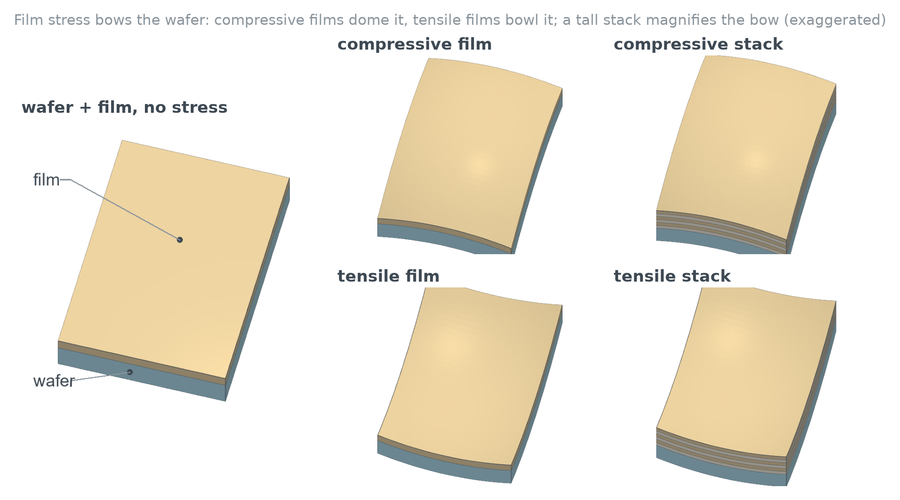

# semi-structures

**Material-aware semiconductor structure diagrams and process-flow models
for Python.**

[](https://github.com/m-worm/semi-structures/actions/workflows/ci.yml)
[](https://www.python.org/downloads/)
[](LICENSE)



`semi-structures` is a material-aware Python package for drawing
semiconductor structures and expressing simple fabrication flows. It combines
a shared materials language with lightweight vector isometrics, a compact
process-flow API and an optional true-solid Boolean backend.

Color always means material, never circuit role: hue is the chemical family,
lightness tracks electron density and every renderer reads the same palette,
so figures drawn months apart still agree.

The package can be used directly as a conventional Python API, but its small,
descriptive process language is also designed to work well through natural
language with generative-AI coding tools such as Claude Code and Codex. This
makes it possible to describe a semiconductor structure or fabrication flow
in ordinary language, then have the coding tool translate and refine that
description as reproducible Python code.

It also ships a command-line interface and a Model Context Protocol (MCP)
server, so shells, CI and chatbots drive the same operations without a coding
harness. See [Command line and MCP server](#command-line-and-mcp-server).

## Motivation

Semiconductor structure figures need to communicate geometry, layer order
and material identity while still looking polished at publication size.
General-purpose drawing and solid-modeling tools can create the shapes, but
they do not normally enforce a semiconductor material language or a
consistent visual style. `semi-structures` provides reusable Python primitives and a
shared material palette so related figures can be revised and regenerated
without manually redrawing them or changing material colors from one figure to
the next.

There are two complementary ways to author a figure. The Python API can be
used directly for precise, version-controlled construction. Alternatively, a
generative-AI coding assistant such as Claude Code or Codex can translate a
natural-language description into an editable example script. A multimodal
assistant can also use a supplied example image as a visual reference for the
structure, camera angle, composition or callouts while producing a new
schematic with the package's consistent material coloring.

The package itself does not automatically infer a fabrication process from an
image, and generated code remains a draft that must be reviewed. The user is
responsible for geometry, dimensions, layer order, scientific accuracy and
appropriate citation of source images. The goal is to combine assisted
authoring with transparent Python code and reproducible, publication-quality
output.

The project is currently an alpha package. The existing `Wafer` process API
is stable enough for the included examples. The broader nanometer-based
process language and its status table are in [`ROADMAP.md`](ROADMAP.md).

## Features

- One material palette shared by every renderer.
- One typography law in every renderer: text sizes are points at print
  width, converted to pixels by the solid backend, never below 7 pt.
- `Wafer.render()`: one call from process model to picture with any
  renderer, with automatic feature callouts (`labels="all"` or a selection).
  `view="section"` gives the 2D side-on cross-section from the same model.
- Stable feature references (`Layer`, `EtchFeature`, `FillFeature`,
  `RegionFeature`) with names, `Wafer.find()` and `nm`/`um`/`mm` units.
- JSON serialization: `Wafer.to_json()` / `Wafer.from_json()` store the
  process recipe, not the derived geometry, so a document replays to the
  same model and the same pixels.
- A command-line interface (`semi-structures`) and an MCP server
  (`semi-structures-mcp`) over the same typed operations: validate, inspect,
  render and export process documents, and also query the palette.
- Dedicated packaging materials: dark-gray package laminate, PCB green and
  tin-gray solder balls.
- Transparent single-crystal substrates: `sapphire` (bulk Al2O3) and
  `SiC-wafer` are near-clear tints with a per-material drawing alpha
  (`style.MATERIAL_ALPHA`, `alpha_for()`) honored by the vector, section and
  solid renderers. Both are separate from the opaque device color `SiC` and
  the thin-film dielectric `Al2O3`.
- Vector-friendly isometric boxes, pillars, labels and rectangular openings.
- Circular wafers with an optional V-notch or major flat
  (`Wafer(..., shape="circle", notch="V"|"flat", notch_angle=...)`), cut
  through the substrate and every inheriting film.
- Process verbs for blanket, repeated, backside and localized deposition,
  for rectangle, circle and ellipse etches, for exact fills, for implants
  and material replacement, for `strip()` on resist and sacrificial films
  and for rectangular mesa formation. An etch takes an optional sidewall
  angle (`etch(..., taper=deg)` cuts a truncated cone, elliptical cone or
  pyramid) and its fill inherits the profile.
- Square and hexagonal lattices for hole, pillar and pad arrays
  (`square_lattice`, `hex_lattice`), and stack breaks for tall repeats:
  `add_multilayer(..., repeats=100, show=(10, 5))` draws the bottom 10 and
  top 5 pairs, cuts everything crossing the gap in both renderers and
  brackets the block "x100 pairs (85 not drawn)".
- Automatic renderer selection: rectilinear flows (films, etches of any
  depth, fills, mesas) stay exact vector PDF, while wafer cylinders,
  curved/rotated geometry, tapered sidewalls and implants use robust
  trimesh/manifold3d solids rendered by PyVista.
- Solid scenes also support shells, arbitrary Boolean cuts, capped cutaways,
  transparency, bowed slabs (`box(bow=)` for film-stress figures), and
  3D-anchored routed labels with optional stick-and-ball dots.
- Twenty-eight reproducible example generators. Twenty-two of the figures
  are collected in a referenced, multi-page LaTeX showcase, and no figure
  carries text below 7 pt.
- The reference-image workflow, demonstrated by six figures authored by a
  multimodal assistant from supplied images. Three keep the package's
  material palette: the CoWoS-style GPU package with six HBM stacks, drawn
  assembled and again exploded, and a simplified backside-power block. Three reproduce their reference's role or
  presentation colors on request, as explicit and separate overrides
  (`background=`/`edge_color=` on the solid renderer, raw hex fills).
- MIT licensed.

Semiconductor device structures should normally be authored through the
process domain-specific language (DSL). `backend="auto"` then chooses the least expensive renderer that
preserves the requested geometry. Direct `Box`, `Pillar` or `Scene`
primitives remain useful for renderer regression tests, package assemblies,
annotations and deliberately abstract diagrams. They should not be used to
imitate an etch, fill or implant by overlapping independent solids.

## Installation

```text
git clone https://github.com/m-worm/semi-structures.git
cd semi-structures
python -m pip install -e ".[solid]"
```

The core package needs Python 3.10+, NumPy and Matplotlib, which is enough
for the vector-isometric and 2D section renderers. The extras are optional
and additive:

| Extra | Adds | For |
|---|---|---|
| `solid` | Pillow, PyVista, trimesh, manifold3d | the true-solid Boolean backend |
| `mcp` | the MCP SDK | the `semi-structures-mcp` server |
| `dev` | pytest, build | running the tests and building a distribution |

```text
python -m pip install -e .                    # core only
python -m pip install -e ".[solid,mcp,dev]"   # everything
```

Check the install by running the tests and regenerating every figure into
`docs/figures/`:

```text
python -m pytest
python examples/run_all.py
```

## Quick start

```python
from semi_structures import Circle, Ellipse, Rectangle, Wafer, nm, um

# A scalar size is the diameter of a circular full wafer. Blanket films
# inherit that footprint and therefore become true cylinders. Every verb
# takes name= and returns a stable feature reference.
wafer = Wafer(size=300 * um, shape="circle", substrate="Si",
              thickness=725 * um, name="Si")
oxide = wafer.add_layer("SiO2", 50 * nm, name="oxide")

via = wafer.etch(Circle((150 * um, 150 * um), diameter=10 * um),
                 stop_on="Si", name="via")
trench = wafer.etch(Rectangle((120 * um, 100 * um), (20 * um, 8 * um)),
                    depth=30 * nm, name="trench")
contact = wafer.etch(Ellipse((185 * um, 105 * um), (8 * um, 4 * um),
                             rotation=25), depth=40 * nm, name="contact")
# taper= is the sidewall angle from vertical: this via is a truncated cone,
# and its plug inherits the same slope.
slope = wafer.etch(Circle((60 * um, 60 * um), diameter=12 * um),
                   depth=40 * nm, taper=8, name="tapered via")
wafer.fill(slope, "Cu", name="tapered plug")
wafer.fill("via", "W", name="W plug")
wafer.fill(trench, "Cu", name="Cu line")
wafer.fill(contact, "SiP", overfill=10 * nm)
wafer.implant(Rectangle((90 * um, 165 * um), (25 * um, 40 * um)),
              "SiP", depth=500 * nm, name="well")

# One call from model to picture. auto -> solid here (circular wafer,
# curved etches, implant); rectilinear flows stay exact vector PDF.
wafer.render(path="wafer_process.png", labels=["oxide", "W plug", "well"],
             print_width_in=6.3)
```

Rectangular and square substrates use `shape="rectangle"` (the default) or
`shape="square"`. Pass a `Rectangle`/`Circle` as `footprint=` for a custom
center. A blanket film inherits the substrate footprint, and a
`Rectangle(...)`, `Circle(...)` or `Ellipse(...)` passed to
`add_layer(shape=...)` overrides it.

**Conventions worth knowing**

- Process shapes are **center-based**. `add_pad(x, y, dx, dy)` and
  `drill(x, y, dx, dy)` are the two lower-left-corner conveniences, and
  `Rectangle.from_corner(...)` converts between them.
- `nm`, `um`, `mm` are plain multipliers (`nm = 1.0`), so scripts written in
  arbitrary drawing units keep working unchanged.
- Every verb returns a public feature (`Layer`, `EtchFeature`,
  `FillFeature`, `RegionFeature`) with `name`, `kind`, `z0/z1/top`, `shape`
  and an `anchor`. Use `wafer.find(name)` and `wafer.features` to retrieve
  them. `etch(stop_on=)` and `fill()` accept a name or a reference.
- Dispatch: `render()`/`model()` use the vector engine for every
  rectilinear flow (axis-aligned films, etches of any depth, fills, mesas)
  and draw it exactly by splitting each solid at the etch limits. Curved or
  rotated shapes, tapered sidewalls, circular wafers and implants select the
  Boolean solid model. `backend="solid"` forces a shaded render, and
  `backend="vector"` raises rather than approximate.
- `render(ax=...)` draws into a matplotlib axes: vector at `origin`/`scale`,
  solid via `imshow` at `extent`, or `view="section", y=...` for the 2D
  cross-section. `render(path=...)` writes a file instead. `labels="all"` or
  a list of names adds callouts in an automatic two-column layout, and the
  boxes or `Scene` are returned for further annotation.

**Typography law.** Every text size, in every renderer, is *points at print
width*: author at the width the figure will print (6.3 in for a full-width
figure on a typical page) and nothing goes below 7 pt. The solid backend takes `size=`
in points and converts to pixels itself once `render()` knows the printed
width (`print_width_in`, `dpi=300` sizes the window). The vector engine
takes matplotlib points directly. Both refuse smaller sizes.

True solids and backend-native callouts are available separately:

```python
from semi_structures.solid import Scene

scene = Scene()
scene.box((0, 0, 0), (1000, 700, 200), "Si")
scene.drill_hole(x=500, y=350, r=60)
scene.label("via", anchor=(500, 350, 200), position=(0.85, 0.35),
            size=8.2, bold=True)                 # points at print width
scene.text2d("Via testcase", position="upper_left", size=10.0)
scene.render("via.png", print_width_in=6.3)     # 300 dpi at 6.3 in
```

`bold` selects the bold face, and `Scene(font=..., font_bold=...)` names a
TrueType face to try before the portable Arial/DejaVu Sans stack. Label
appearance can also be controlled with `color`, `line`, `line_color`,
`line_width` (points), `via` elbow points and `justify`. Fixed titles and
notes use `Scene.text2d()`.

## Saving a model as JSON

A `Wafer` can be written to a JSON document and read back:

```python
wafer.to_json("cell.json")               # or: text = wafer.to_json()
same = Wafer.from_json("cell.json")      # path, JSON string, or file
```

What is stored is the **recipe**, the ordered verb calls with their
arguments, not the derived geometry. The document therefore stays valid if
the internal representation changes, and it can be read and edited by hand:

```json
{
  "format": "semi-structures/wafer", "version": 1,
  "wafer": {"size": [10.0, 6.0], "thickness": 2.0, "name": "Si wafer"},
  "operations": [
    {"op": "add_layer", "material": "SiO2", "thickness": 1.2},
    {"op": "etch", "shape": {"shape": "rectangle", "center": [5.0, 3.0],
      "size": [4.0, 6.0], "rotation": 0.0}, "stop_on": {"$ref": {"op": 0}}},
    {"op": "fill", "hole": {"$ref": {"op": 1}}, "material": "Cu"}
  ]
}
```

Arguments left at their defaults are omitted, and a convenience verb is
stored as the call you wrote rather than the primitives it expands into
(`add_multilayer`, not forty `add_layer` calls). Feature references such as
`etch(stop_on=...)`, `fill(hole)` and `strip(layer)` are `{"$ref": {"op": i}}`
addresses pointing at the operation that produced the feature, with
`{"op": -1}` meaning the substrate, so an unnamed model round-trips exactly
like a named one.

The round-trip is exact in the strong sense: the rebuilt model draws the
same pixels, which `examples/fig_serialization_roundtrip.py` demonstrates
and the test suite asserts by comparing SHA-256 digests of the two
renderings.



`Wafer.to_dict()` and `Wafer.from_dict()` give the same document as a plain
Python dictionary. This is the format the command line and the MCP server
exchange, so the same file drives a shell pipeline and a chatbot.

## Authoring from reference images

The intended workflow with a multimodal coding assistant is:

1. Supply a reference image and describe what it shows. The image is used
   for **composition, viewpoint and the callout set only**. The assistant
   writes a new package script with its own schematic geometry (dimensions
   chosen for legibility, not measured from the picture).
2. Record where the image came from in
   [`examples/REFERENCES.md`](examples/REFERENCES.md). The reference is
   never redistributed with the package.
3. Keep the material palette unless you explicitly ask for the reference's
   own colors. Circuit-role or presentation colors (raw hex fills, a dark
   background via `Scene.render(background=..., edge_color=...)`) are
   permitted, but they are deliberate exceptions to the palette law and live
   in separate, clearly labeled scripts so the material-colored figures
   remain the defaults.
4. Review the result as you would any figure. Geometry, layer order,
   terminology and citation are the user's responsibility.

[`docs/prompt-gallery.md`](docs/prompt-gallery.md) lists example prompts
and the figures they produce. Six examples show the reference-image
workflow end to end. `fig_gpu_cowos_assembled.py` and
`fig_gpu_cowos_exploded.py` (a CoWoS-style GPU package assembled and then
exploded: substrate, C4 field, interposer, microbumps, GPU die and six HBM
towers) and
`fig_backside_power_simple.py` (the simplified backside-power block:
exploded signal plates slotted around one nTSV) keep the material palette.
`fig_transistor_evolution_rolecolor.py`, `fig_dram3d_reference_colors.py`
and `fig_dram3d_capacitor_schematics.py` reproduce their references' role or
presentation schemes on request, all on the solid backend. Three practical
tips came out of them. Render a small contact sheet of candidate camera
azimuths when matching a viewpoint (`azimuth=-120` looks from +x, -y with
low-y features front-left, and the default looks from +x, +y). Declare each
panel's printed width so callouts land at their point size. Place callouts
in the white margins with `via=` elbows.

## Project layout

```text
semi-structures/
|-- src/semi_structures/   installable Python package
|-- examples/              all worked figure generators
|-- docs/                  guides, showcase source and generated figures
|   `-- figures/           generated PDF and PNG figures
|-- tests/                 package and interface tests
|-- .github/workflows/     continuous integration
|-- pyproject.toml         build metadata, extras and console scripts
|-- ROADMAP.md             release checklist and capability status
|-- CONTRIBUTING.md        house rules and definition of done
|-- CHANGELOG.md           release history
`-- LICENSE                MIT license
```

The reusable modules are:

| Module | Purpose |
|---|---|
| `semi_structures.style` | Materials, alloy colors, typography, line roles, and figure sizes |
| `semi_structures.iso` | Fast vector-isometric primitives and projection |
| `semi_structures.process` | Fabrication-style `Wafer` operations, reusable shapes, feature references, `nm`/`um`/`mm`, ordered history, conservative backend selection, and one-call `render()` |
| `semi_structures.solid` | True meshes, Booleans, curved geometry, cutaways, and labels |
| `semi_structures.section` | 2D x-z cross-sections of the process model at a plane (bands, gaps, inserts, breaks, callouts) |
| `semi_structures.serialize` | JSON process documents: the recipe, not the geometry |
| `semi_structures.mcp_tools` | The typed operations behind both front-ends |
| `semi_structures.cli` | The `semi-structures` command line |
| `semi_structures.mcp_server` | The `semi-structures-mcp` MCP server |

## Examples

Run a single example from the project root:

```text
python examples/fig_dram3d.py
python examples/fig_hbm_labeled.py
```

Or regenerate every example:

```text
python examples/run_all.py
```

A few of them:

| | | |
|:--:|:--:|:--:|
|  |  |  |
| 3D NAND: hexagonal memory-hole array, nested charge-trap fills | An exploded CoWoS-style GPU package with six HBM stacks | 4H-SiC power devices: implants, trenches, nested fills |
|  |  |  |
| A six-step photolithography flow as 2D sections of one model | The palette: hue = family, lightness = electron density | Film stress bowing a wafer, compressive and tensile |

Every generator writes into `docs/figures`. The set covers the material
palette key and the chart style guide, the transistor line-up in three
renderings (vector isometric, solid and role-colored solid), DRAM and NAND
memory generations, a process-DSL 3D DRAM and a 3D NAND with a hexagonal
memory-hole array in slit-separated blocks. It also covers III-V and
III-nitride emitters, 4H-SiC power devices, backside power delivery in a
detailed and a simplified form, the HBM and GPU packages, plus the
reference-image set above. See
[`examples/README.md`](examples/README.md) for the complete list and the
feature-coverage table.

## Documentation

- [`docs/guide.md`](docs/guide.md): the manual, covering the process DSL,
  all three renderers, the solid API and the complete palette reference.
- [`docs/interfaces.md`](docs/interfaces.md): the command line and the MCP
  server, with the tool list and the safety rules.
- [`docs/prompt-gallery.md`](docs/prompt-gallery.md): example prompts and
  the figures they produce, one row per script, plus prompts the API
  answers without a new script.
- [`docs/structure3d-skill.md`](docs/structure3d-skill.md): the compact
  rule sheet a coding assistant follows when drawing with the package.
- [`examples/README.md`](examples/README.md): every generator and the
  features it covers.
- [`examples/REFERENCES.md`](examples/REFERENCES.md): structural references,
  DOI links and the provenance of every supplied reference image.
- [`ROADMAP.md`](ROADMAP.md): the release checklist, the audited
  capability-status table and where the process language is heading.
- [`CONTRIBUTING.md`](CONTRIBUTING.md): house rules, how to verify and what
  "done" means for a new capability.
- [`CHANGELOG.md`](CHANGELOG.md): release history.
- [`docs/showcase.tex`](docs/showcase.tex): standalone LaTeX showcase with a
  dated cover, contents and backend overview, front-matter AI declaration,
  referenced examples and the generating script named in every figure
  caption.

The built document is in the repository as
[`docs/showcase.pdf`](docs/showcase.pdf) (26 pages), so it can be read
without a LaTeX installation. To rebuild it after regenerating the examples:

```text
cd docs
pdflatex showcase.tex
pdflatex showcase.tex
```

## Command line and MCP server

Besides the Python API there are two front-ends, both thin wrappers over the
same functions, so they cannot disagree.

The **command line** works on JSON process documents, with `-` for standard
input so the commands compose:

```text
semi-structures materials --table            # the palette
semi-structures example damascene > cell.json
semi-structures validate cell.json           # exit 1 if invalid
semi-structures inspect cell.json            # bounds, features, history
semi-structures render cell.json -o fig.png --view section
semi-structures export cell.json > build.py  # an editable script
```

The **MCP server** gives a chatbot or coding agent the same operations as
eight typed tools over stdio:

```text
python -m pip install "semi-structures[mcp]"
semi-structures-mcp          # or: semi-structures serve
```

`list_materials`, `get_material`, `list_examples`, `get_example`,
`validate_process`, `inspect_structure`, `render_structure`, `export_python`.
It never executes caller-supplied code, because a request is a process
document replayed through an allowlist of DSL verbs. It writes only into one
configured directory (`SEMI_STRUCTURES_MCP_OUTPUT`) and bounds document
size, repeat counts and image dimensions.

[`docs/interfaces.md`](docs/interfaces.md) has the full command reference,
the tool table, client configuration and the safety rules.

## Development

```text
python -m pytest             # the suite, including the doc examples
python examples/run_all.py   # every figure, into docs/figures/
python -m build              # sdist and wheel
```

Tests are `unittest`-style and also run under pytest. Those needing an
optional dependency skip when it is not installed. CI runs the suite on
Linux and Windows for Python 3.10-3.12, exercises the command-line entry
points, regenerates every figure and builds the distribution
([`.github/workflows/ci.yml`](.github/workflows/ci.yml)).

Contributions are welcome through issues and pull requests.
[`CONTRIBUTING.md`](CONTRIBUTING.md) has the house rules (color means
material, nothing below 7 pt, author through the DSL) and what "done"
means for a new capability.

## Declaration of generative AI use

This project was prepared with the assistance of generative AI models
(OpenAI's 5.6 Sol and Anthropic's Claude Fable 5). The tools were used to
draft and restructure code and prose, to propose organization, to assist with
figures and documentation and to copyedit. All scientific content, technical
judgments and structural decisions are my own. I have reviewed and verified
the code, text, figures and references, and I am solely responsible for the
accuracy of the work. Consistent with current publishing guidance, the AI
systems are not authors of this project: they cannot take responsibility for
the content and cannot hold or assign copyright, and they are therefore not
credited as authors or co-authors.

## License

Released under the [MIT License](LICENSE). The software and its documentation
are provided as is, without warranty of any kind and without liability. The
figures are schematic illustrations built from publicly available descriptions
and figures, with dimensions chosen for legibility. No claim is made that any
figure represents a real device, process or product accurately, none is a
process-qualified drawing, and nothing in them should be used as design or
fabrication data.
